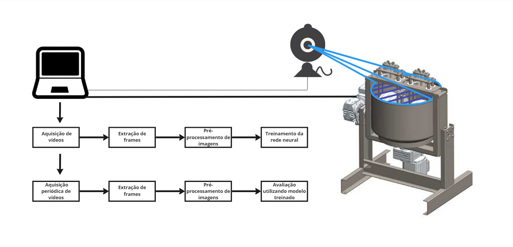
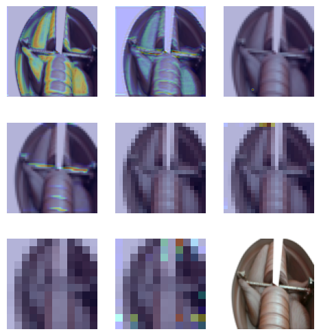
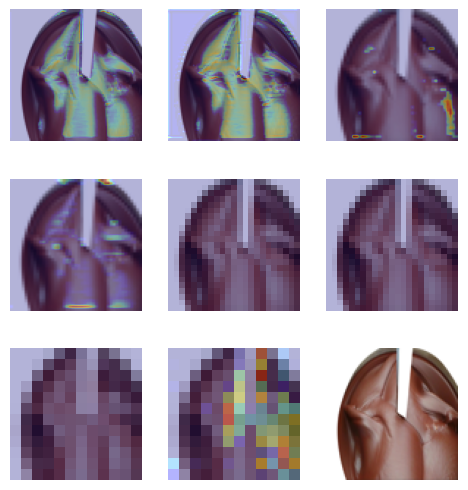

> Grupo S15 - Trabalho de conclusão de curso.
> Escola Politécnica da Universidade de São Paulo, 2022.

##### Título
Automação do processo de refino da massa de cacau para projeto Amazônia 4.0

##### Integrantes: 
- Diego Hidek Caetano Ide
- Gustavo Donnini Chen
- Paulo Roberto Machado dos Santos

##### Orientadora:
- Profa. Dra. Tereza Cristina Melo de Brito Carvalho

------

### Projeto Amazônia 4.0

O projeto Amazônia 4.0 visa trazer uma nova via não destrutiva de desenvolvimento para a Amazônia. Discussões sobre esse tópico já existem há anos, e duas vias já foram trilhadas sem sucesso:

- Foco na preservação da floresta e dos habitantes da Amazônia
  - Não promoveu a modernização nem o desenvolvimento da região, não solucionando seus problemas sócio-econômicos.
    
- Foco no desenvolvimento local através do incentivo à agricultura, mineração e produção de energia
  - Aumentou a quantidade de casos de desflorestamentos, roubos de terras e queimadas na região.

A nova via foca no desenvolvimento sustentável da região usando a biodiversidade e os conhecimentos tanto científicos quanto tradicionais, atraindo desenvolvimento através da **agregação de valor nos produtos nela produzidos**.

Essa terceira via pretende alcançar seus objetivos através de uma abordagem multidisciplinar, atuando nas áreas de pesquisa, sustentabilidade, sociobiodiversidade e indústria 4.0.
> Este projeto se encontra no contexto de indústria 4.0.

Este braço do projeto tem como objetivo agregar valor aos commodities produzidos na Amazônia através do processamento destes em laboratórios móveis, que percorrerão as comunidades amazônicas oferecendo cursos sobre produção de chocolate e tópicos relacionados.

### Objetivo

Atuando na etapa de moagem, o sistema deve ser capaz de **supervisionar o processo de refino da massa de cacau em produção e encerrar o processo automaticamente** quando julgar que a massa está pronta.

*Figura 1: Diagrama do sistema*

A supervisão deve ser feita através de imagens da massa adquiridas durante seu refino através de uma *webcam*. Essas imagens deverão ser processadas pelo sistema, que deve ser executado em uma unidade de processamento qualquer. Durante o desenvolvimento, foi utilizado um computador.

### Metodologia

O grupo iniciou o trabalho analisando a viabilidade de uma solução baseada em deep learning. Foi concluído que a solução era viável através de uma rede modelo Xception.

Concluiu-se que deveriam ser inicialmente utilizados frames de vídeos retirados da internet na geração do banco de imagens para que  o cronograma do grupo não fosse prejudicado, mesmo que isso implique em uma quantidade baixa de imagens. Iniciou-se o desenvolvimento dos programas necessários para essa aquisição.

Foi desenvolvida a rede neural no modelo Xception através da biblioteca Keras e fez-se um treinamento, que indicou que a rede atribui pesos grandes a detalhes não muito relevantes das imagens. Para solucionar o problema, foi desenvolvido um programa de aplicação de máscaras. Refeito o treino, foram encontrados resultados satisfatórios.

Por fim, foram desenvolvidas as rotinas de treinamento e de supervisão, que juntam todos os códigos já desenvolvidos para criar dois fluxos completos do software.

*Figura 2: Visualização do resultado do modelo*

### Resultados:

O software é capaz de extrai aproximadamente 275 gravações curtas da massa de cacau em produção ao longo das 48h do processo, totalizando aproximadamente 20.000 imagens para o treinamento da rede. A aplicação da máscara sobre cada uma das imagens acontece de forma automática, ao fim das gravações.

A classificação das massas entre "prontas" e "não prontas" se dá de forma manual. Para realizar uma classificação precisa, é necessário identificar a marca de tempo em que a massa da gravação alcançou o fim do refino. Esse parâmetro deve ser adquirido através da medição das partículas que compõe a massa. O projeto dispõe de um equipamento capaz de realizar tal medição.

O modelo apresentou métricas satisfatórias com o banco de imagens utilizado (1696 amostras). A quantidade ideal de épocas para o treinamento é 23, alcançando uma precisão de 99.41%. Treinamentos com mais épocas geram um *overfitting* crescente, prejudicando a precisão do modelo.

A matriz de confusão aponta uma baixa ocorrência de erros do tipo I e II. Por se tratarem de erros críticos, medidas mitigadoras foram tomadas.

Em suma, os objetivos foram devidamente cumpridos, salvo a integração do sistema com os equipamentos do projeto Amazônia 4.0.
